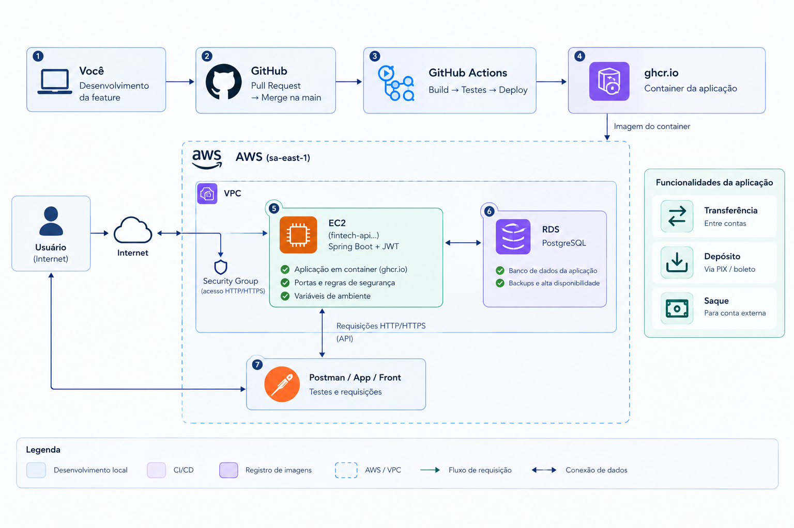

# Fintech Core 

Backend de uma aplicação financeira desenvolvido com Java e Spring Boot.

O projeto está sendo construído como um projeto pessoal para colocar em prática conceitos de desenvolvimento de APIs, segurança, persistência de dados, testes, containers e infraestrutura em cloud.

## Funcionalidades

- Autenticação e autorização com Spring Security e JWT
- Cadastro e gerenciamento de usuários
- Depósito
- Saque
- Extrato
- Transferência entre contas
- Operações financeiras com controle transacional utilizando `@Transactional`
- Persistência em PostgreSQL
- Testes utilizando H2

## Arquitetura



A aplicação é executada em um container Docker na AWS EC2 e utiliza PostgreSQL através do Amazon RDS.

O fluxo de desenvolvimento e entrega utiliza GitHub, GitHub Actions e GitHub Container Registry (GHCR).

### Fluxo

```text
Feature
   ↓
Pull Request
   ↓
GitHub Actions
   ↓
Build + Testes
   ↓
Merge na main
   ↓
Imagem Docker
   ↓
GHCR
   ↓
Deploy na EC2
   ↓
Aplicação + RDS PostgreSQL
```

## Stack

### Backend

- Java
- Spring Boot
- Spring Security
- JWT
- Spring Data JPA
- Hibernate

### Banco de dados

- PostgreSQL
- H2

### Infraestrutura

- Docker
- AWS EC2
- AWS RDS
- AWS VPC
- Security Groups
- GitHub Actions
- GitHub Container Registry

## Testes

Os testes de persistência utilizam H2 para manter o ambiente de testes isolado do PostgreSQL utilizado pela aplicação.

As operações que envolvem alteração de dados financeiros utilizam `@Transactional`, mantendo as alterações relacionadas dentro de uma mesma transação.

## CI/CD

O projeto utiliza GitHub Actions para automatizar o processo de build e testes.

Após a validação do pipeline, a aplicação é empacotada em uma imagem Docker e publicada no GitHub Container Registry. Essa imagem é utilizada no ambiente da EC2.

## Infraestrutura AWS

A aplicação está hospedada na região `sa-east-1`.

Atualmente a infraestrutura utiliza:

- **EC2** — execução da aplicação
- **RDS PostgreSQL** — persistência dos dados
- **VPC** — rede da aplicação
- **Security Group** — controle das regras de acesso
- **GHCR** — registro da imagem Docker

## Em desenvolvimento

O projeto continua em evolução. A infraestrutura e a aplicação serão incrementadas conforme novas funcionalidades forem implementadas e novos conceitos forem estudados.

## Projeto

Repositório: https://github.com/Paccanaro18/fintech-core

---

<p align="center">
  
</p>
